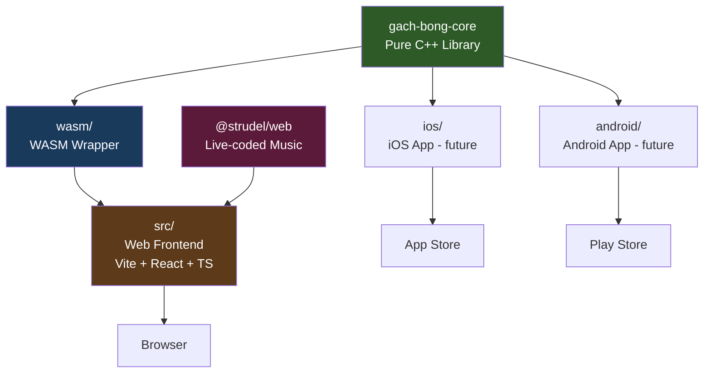

# Project Architecture

## Overview

Gạch Bông is a Vietnamese cement tile matching game built as a monorepo with a shared C++ core library and platform-specific wrappers.

```
gach-bong/
├── gach-bong-core/         ← Pure C++ library (platform-independent)
├── wasm/                   ← WebAssembly wrapper (Emscripten)
├── src/                    ← Web frontend (Vite + React + TypeScript)
│   ├── components/         ← UI components (game, showcase, MV)
│   ├── music/              ← Strudel live-coded music compositions
│   └── styles/             ← CSS (index.css, MusicVideo.css)
├── docs/                   ← Documentation
│   └── mv/                 ← MV timeline scripts & assets
└── public/                 ← Static assets
```

## Dependency Graph



## Layer Breakdown

### 1. Core Library (`gach-bong-core/`)

A pure C++17 static library containing all platform-independent game logic and pattern rendering. Zero external dependencies.

| Component | Description |
|-----------|-------------|
| `geometry.h` | `Point`, `Color`, polygon/star generators, bezier math |
| `renderer.h` | `IRenderer` — abstract rendering interface |
| `patterns.h` | `PatternType` enum, `Palette` struct, color palettes |
| `board.h` | `Board` class — grid management, tile matching, shuffling |
| `pathfinder.h` | `Pathfinder` — BFS path finding with ≤2 turns |
| `src/patterns/` | 20 pattern renderers organized by category |

See [Core Library Documentation](core-library.md) for build instructions and API reference.

### 2. WASM Wrapper (`wasm/`)

A thin Emscripten wrapper that provides:
- `CanvasRenderer` — concrete `IRenderer` using HTML5 Canvas 2D API
- `engine.cpp` — Embind exports bridging C++ to JavaScript

**Only 2 source files** — all game logic lives in the core library.

### 3. Web Frontend (`src/`)

Vite + React + TypeScript application that:
- Loads the compiled WASM module (`gach_bong.js` + `gach_bong.wasm`)
- Handles user input, UI overlay, scoring, and animations
- Renders the game board on a `<canvas>` element

### 4. Music & MV System (`src/music/`, `src/components/MusicVideo.tsx`)

- Live-coded music compositions written in [Strudel](https://strudel.cc) (TidalCycles for the browser)
- `@strudel/web` provides `initStrudel()`, `evaluate()`, `hush()` for programmatic playback
- MV component: scene-based timeline system with `requestAnimationFrame` loop, renders patterns via WASM engine, syncs with Strudel music
- See [MV docs](mv/01-intro.md) for timeline scripts

## Platform Integration Strategy

The core library compiles to any platform that supports C++17:

| Platform | Build Tool | Renderer | Link Method |
|----------|-----------|----------|-------------|
| **Web** | Emscripten | Canvas 2D (`CanvasRenderer`) | WASM module |
| **iOS** | Xcode / CMake | Core Graphics or Metal | Static lib (`.a`) |
| **Android** | NDK / CMake | Canvas or OpenGL | Shared lib (`.so`) via JNI |
| **Flutter** | CMake | Skia or platform canvas | FFI (`dart:ffi`) |
| **Desktop** | CMake | SDL, OpenGL, or Skia | Static/dynamic lib |

Each platform only needs to:
1. Implement `IRenderer` with its graphics API
2. Link `libgachbong_core.a`
3. Call the core API functions
