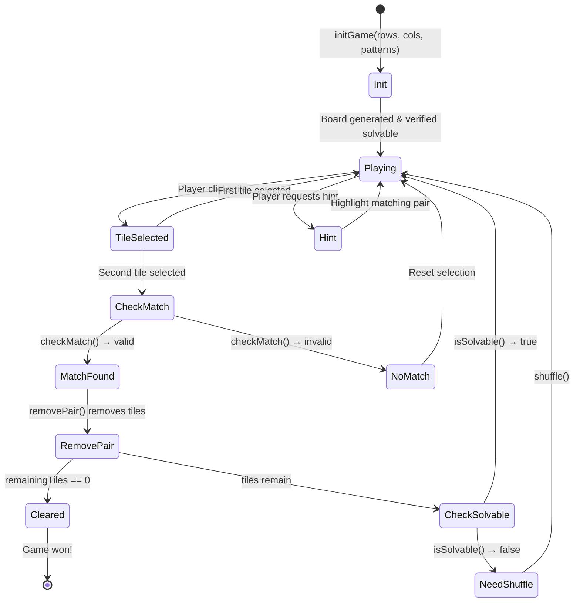

# Game Logic

Technical documentation of the Gạch Bông tile matching game mechanics implemented in the core C++ library.

## Overview

Gạch Bông is a **tile matching** (Shisen-Sho / Four Rivers) game where players match pairs of identical tiles that can be connected by a path with **at most 2 turns**. The game ends when all tiles are cleared.

## Board Generation

### Algorithm (`Board::generateBoard`)

1. **Grid dimensions**: `rows × cols` (must be even total cells; if odd, `cols` is reduced by 1)
2. **Pair creation**: For `N = totalCells / 2` pairs, each pair gets:
   - A tile type: `i % numPatterns` (cycles through available patterns)
   - A palette index: `i % 12` (cycles through palette variations)
3. **Shuffle**: Fisher-Yates shuffle via `std::shuffle` with time-seeded RNG
4. **Grid placement**: Shuffled tiles placed left-to-right, top-to-bottom
5. **Solvability check**: `ensureSolvable()` is called after generation

```
Example: 4×6 board with 4 patterns
┌───┬───┬───┬───┬───┬───┐
│ C │ A │ D │ B │ A │ C │  A,B,C,D = PatternType (0-3)
├───┼───┼───┼───┼───┼───┤  Each appears exactly N/4 times
│ B │ D │ A │ C │ D │ B │  (in pairs)
├───┼───┼───┼───┼───┼───┤
│ D │ B │ C │ A │ B │ A │
├───┼───┼───┼───┼───┼───┤
│ A │ C │ B │ D │ C │ D │
└───┴───┴───┴───┴───┴───┘
```

### Solvability Guarantee (`Board::ensureSolvable`)

After generation (and after each shuffle), the board is checked for solvability:

1. Call `Pathfinder::isSolvable(grid)` to check if at least one valid match exists
2. If not solvable, re-shuffle all remaining tiles and check again
3. Repeat up to 50 attempts (prevents infinite loops)

## Tile Matching Rules

Two tiles can be matched if:
1. They have the **same `PatternType`** (tile type index)
2. A **valid path** exists between them with **≤ 2 turns**
3. The path only passes through **empty cells** or **outside the board boundary**

> **Note**: Tiles with the same pattern type but different palette indices **can still match** — only the pattern type matters for matching.

## Pathfinding Algorithm

### BFS with Turn Counting (`Pathfinder::findPath`)

The pathfinder uses **Breadth-First Search** on an expanded grid to find the shortest valid path.

#### Expanded Grid

The grid is expanded by 1 cell in each direction to allow paths that travel outside the board boundary:

```
  ░░░░░░░░░░░░░  ← expanded border (always empty)
  ░┌──────────┐░
  ░│  Board    │░  Board coordinates (r,c) map to
  ░│  cells    │░  expanded coordinates (r+1, c+1)
  ░│           │░
  ░└──────────┘░
  ░░░░░░░░░░░░░░  ← expanded border
```

#### BFS State

```cpp
struct BFSState {
  int r, c;       // Current position (in expanded grid)
  int dir;        // Direction we arrived from (0=up, 1=right, 2=down, 3=left)
  int turns;      // Number of turns taken so far
  vector<pair<int,int>> path;  // Waypoints visited
};
```

#### Algorithm Steps

1. **Initialize**: From source tile, try all 4 directions. Each is a starting state with 0 turns.
2. **Expand**: For each state, try all 4 directions:
   - Same direction → `turns` stays the same
   - Different direction → `turns + 1`
   - Skip if `turns > 2`
3. **Passable check**: A cell is passable if:
   - Outside the original board bounds (expanded border), OR
   - Inside the board but empty (`grid[r][c] < 0`)
4. **Pruning**: `visited[r][c][dir]` tracks minimum turns to reach `(r,c)` from direction `dir`. Skip if we've reached here with fewer turns.
5. **Result**: Return the path with fewest turns (and shortest length as tiebreaker).

#### Path Example

```
┌───┬───┬───┬───┬───┬───┐
│ A │ X │ X │ X │ _ │ _ │  A at (0,0) matches A at (2,3)
├───┼───┼───┼───┼───┼───┤
│ _ │ X │ _ │ _ │ _ │ _ │  Path: (0,0) → (0,4) → (2,4) → (2,3)
├───┼───┼───┼───┼───┼───┤  Turns: 2 (right→down, down→left)
│ _ │ _ │ _ │ A │ _ │ _ │
└───┴───┴───┴───┴───┴───┘
              ↑
        ┌─────────────┐
        │ A →→→→→→ ↓  │  The path goes through empty cells
        │          ↓  │  and turns at most twice
        │       A ←┘  │
        └─────────────┘
```

## Hint System

### Finding a Hint (`Pathfinder::findAnyMatch`)

1. Group all remaining tiles by type
2. For each type with ≥ 2 tiles, check all pairs using `findPath()`
3. Return the first valid pair found
4. Returns `{{-1,-1}, {-1,-1}}` if no match exists

> **Performance note**: The hint system iterates tiles by type, so it's efficient for boards with many types but few tiles per type. Worst case is O(n²) per type × pathfinding cost.

## Shuffle

### Algorithm (`Board::shuffle`)

1. Collect all remaining tiles (type + palette pairs) and their positions
2. Shuffle the tile-palette pairs using `std::shuffle`
3. Place shuffled tiles back at the same positions
4. Call `ensureSolvable()` to guarantee at least one valid match

> **Important**: Empty cells remain empty. Only non-empty tiles are reshuffled among their current positions.

## Game Flow



## Key Constants

| Constant | Value | Description |
|----------|-------|-------------|
| Max turns | 2 | Maximum turns allowed in a connecting path |
| Max shuffle attempts | 50 | Attempts to make board solvable |
| Pattern count | 20 | Number of available tile patterns |
| Palette count | 6 | Number of color palettes |
| Board padding | 4% | Tile internal padding (`size * 0.04`) |
